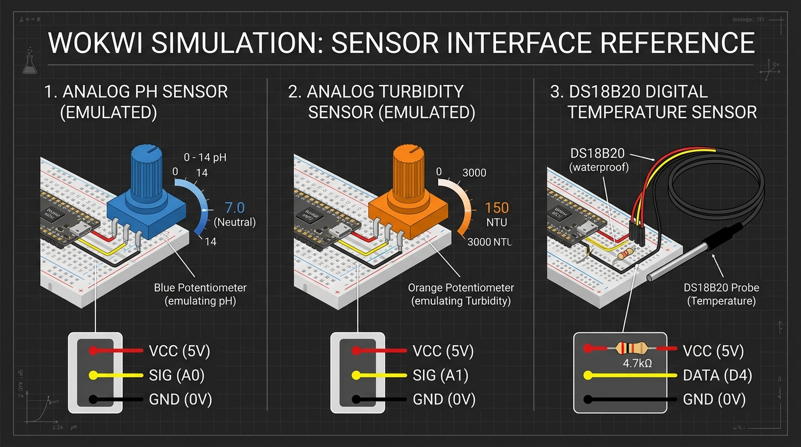
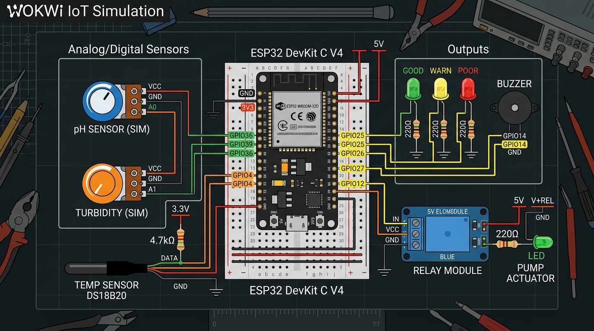

# Academic Project Report
## IoT-Based Smart Water Quality Monitoring and Automated Response System

**Course / Subject:** Embedded Systems & Internet of Things (IoT)  
**Student Name:** Monish Bashar Nawaz (Roll: 241635)  
**Department:** Electronics & Telecommunication Engineering  
**Target Platform:** ESP32 DevKit C V4 (`esp32doit-devkit-v1`)  
**Simulation Environment:** Wokwi for VS Code / PlatformIO Core  
**Repository:** [https://github.com/httpmonish/WaterQualityMonitoring-Hardware](https://github.com/httpmonish/WaterQualityMonitoring-Hardware)  

---

## 1. Executive Summary & Abstract
Water quality monitoring in domestic, industrial, and agricultural reservoirs is critical for preventing health hazards and infrastructure corrosion. Traditional monitoring methods depend heavily on manual sample collection and delayed laboratory spectrophotometry, which cannot provide timely intervention during sudden contamination events.

This project implements an **IoT-Based Smart Water Quality Monitoring and Automated Response System** running in the **Wokwi Embedded Systems Simulator**. The system utilizes an **ESP32 DevKit C V4** microcontroller to continuously acquire three essential water parameters: **pH**, **turbidity**, and **temperature**. 

The microcontroller evaluates real-time data against configured multi-tiered prototype thresholds, classifies water status into **GOOD**, **WARNING**, or **POOR**, triggers automated emergency pump filtration with hysteresis, provides localized visual and acoustic alarms, and streams 5-channel telemetry to the **ThingSpeak IoT Cloud** via Wi-Fi every 20 seconds.

---

## 2. Academic Honesty & Simulation Disclaimers
In compliance with academic integrity and engineering transparency:
1. **Sensor Emulation:** Physical electrochemical glass electrodes and optical nephelometric turbidity sensors are not physically wired in this simulation. Two precision analog potentiometers (`pot_ph` on GPIO 34 and `pot_turb` on GPIO 35) emulate the 0–3.3V analog output signals corresponding to 0–14 pH and 0–100 NTU.
2. **Prototype Thresholds:** All thresholds programmed into the firmware are *configured prototype thresholds* established specifically for demonstration of multi-tiered classification and emergency response, and should not be construed as statutory universal drinking water standards (such as WHO or BIS 10500).
3. **Actuator Emulation:** The green LED (`led1`) represents a *relay-switched simulated pump actuator*, demonstrating automated closed-loop intervention without physical high-voltage pump hardware.

---

## 3. Sensor Interfacing & Signal Acquisition

The system monitors three primary physical/chemical water quality parameters:



### 3.1. Emulated pH Sensor Module
* **Physical Principle:** In field installations, a glass electrode probe generates an analog voltage ($-414\text{ mV}$ to $+414\text{ mV}$) proportional to hydrogen ion activity ($-\log_{10}[H^+]$), amplified by a signal conditioning board to 0–3.3V.
* **Simulation Implementation:** A 10 kΩ rotary potentiometer (`pot_ph`) powered by 3.3V connects to **GPIO 34** (ADC1 Channel 6).
* **Signal Conditioning:** The ESP32 12-bit ADC converts voltages ($0\text{ to }4095$ counts). A 10-sample running average eliminates analog jitter:
  $$\text{pH} = \left(\frac{\text{rawADC}}{4095.0}\right) \times 14.0$$

### 3.2. Emulated Turbidity Sensor Module
* **Physical Principle:** Optical turbidity probes measure light scattering caused by suspended undissolved particles using an infrared emitter and phototransistor (Nephelometric Turbidity Units, NTU).
* **Simulation Implementation:** A rotary potentiometer (`pot_turb`) connects to **GPIO 35** (ADC1 Channel 7).
* **Conversion Formula:**
  $$\text{Turbidity (NTU)} = \left(\frac{\text{rawADC}}{4095.0}\right) \times 100.0$$

### 3.3. Digital Temperature Sensor (Dallas DS18B20)
* **Physical Principle:** Measures thermodynamic temperature using an internal bandgap reference and sigma-delta ADC, transmitting calibrated 12-bit digital readings over the OneWire serial bus.
* **Simulation Implementation:** A `wokwi-ds18b20` component connected to **GPIO 4**, pulled up to 3.3V via a **4.7 kΩ resistor (`r1`)**.
* **Fault Handling:** The firmware handles sensor disconnection (`DEVICE_DISCONNECTED_C = -127.0\ ^\circ\text{C}`) without crashing, classifying disconnected states as an immediate hazard (`POOR`).

---

## 4. Complete System Architecture & Circuit Schematic

The circuit divides neatly into three primary stages: **Inputs (Left)** $\rightarrow$ **Processing (Center)** $\rightarrow$ **Actuators & Cloud (Right)**.



### 4.1. Pin Mapping Table

| Component Identifier | Physical / Emulated Device | ESP32 GPIO | Electrical Specification | Functional Purpose |
| :--- | :--- | :--- | :--- | :--- |
| `pot_ph` | pH Sensor Potentiometer | **GPIO 34** | Analog Input (0–3.3V, 12-bit ADC) | Hydrogen-ion concentration emulation |
| `pot_turb` | Turbidity Potentiometer | **GPIO 35** | Analog Input (0–3.3V, 12-bit ADC) | Suspended particulates emulation |
| `temp1` | DS18B20 Digital Probe | **GPIO 4** | Digital Bidirectional (OneWire) | Water temperature sensing |
| `r1` | Bus Pull-Up Resistor | GPIO 4 $\leftrightarrow$ 3V3 | 4.7 kΩ Resistor | OneWire bus line pull-up |
| `led_good` | Green Status LED | **GPIO 25** | Digital Output (220 Ω limiter) | Visual nominal status indicator |
| `led_warn` | Yellow Status LED | **GPIO 27** | Digital Output (220 Ω limiter) | Visual warning status indicator |
| `led_poor` | Red Status LED | **GPIO 32** | Digital Output (220 Ω limiter) | Visual emergency status indicator |
| `bz1` | Piezo Buzzer | **GPIO 33** | Digital Output (2 kHz pulse) | Acoustic alarm on critical contamination |
| `relay1` | 5V/3.3V Relay Module | **GPIO 26** | Digital Output (Active-Low) | Actuator isolation switch |
| `led1` | Green Pump Actuator | Relay NO $\leftrightarrow$ GND | Switched 3.3V (220 Ω limiter) | Simulated filtration/drain pump |

---

## 5. Classification Logic & Automated Response

### 5.1. Configured Prototype Thresholds
Water quality is evaluated every 2 seconds across three discrete criteria:

| Parameter | GOOD (Nominal) | WARNING (Sub-optimal) | POOR (Hazardous) |
| :--- | :--- | :--- | :--- |
| **pH** | $6.5 \le \text{pH} \le 8.5$ | $6.0 \le \text{pH} < 6.5$ or $8.5 < \text{pH} \le 9.0$ | $\text{pH} < 6.0$ or $\text{pH} > 9.0$ |
| **Turbidity** | $< 20.0\text{ NTU}$ | $20.0 \le \text{Turb} \le 40.0\text{ NTU}$ | $> 40.0\text{ NTU}$ |
| **Temperature** | $15.0 \le T \le 35.0\ ^\circ\text{C}$ | $5.0 \le T < 15.0$ or $35.0 < T \le 40.0\ ^\circ\text{C}$ | $T < 5.0\ ^\circ\text{C}$, $T > 40.0\ ^\circ\text{C}$, or Disconnected |

$$\text{Overall Status} = \max(\text{Status}_{\text{pH}}, \text{Status}_{\text{turb}}, \text{Status}_{\text{temp}}) \quad [\text{POOR} > \text{WARNING} > \text{GOOD}]$$

### 5.2. Automated Pump Control & Hysteresis
To prevent chattering and electrical wear on the relay when a sensor sits directly on a decision boundary, an asymmetric hysteresis algorithm is implemented:
* **Activation (Immediate):** Upon detecting any `POOR` condition, the relay energizes immediately, switching the simulated pump ON and triggering the acoustic buzzer.
* **Deactivation (Debounced):** The pump shuts off only after `PUMP_OFF_CONFIRM_COUNT = 2` consecutive safe evaluation cycles (4 continuous seconds of non-POOR readings).

---

## 6. IoT Cloud Architecture (ThingSpeak)

The ESP32 connects to the virtual access point `Wokwi-GUEST` and synchronizes with MathWorks **ThingSpeak** IoT platform using non-blocking timers (`millis()`) every 20 seconds:

```
[ESP32 Microcontroller]
   │  Wi-Fi 802.11 b/g/n (Wokwi-GUEST)
   ▼
[ThingSpeak REST API (api.thingspeak.com)]
   │
   ├── Field 1: pH (Floating-point)
   ├── Field 2: Turbidity (NTU)
   ├── Field 3: Temperature (°C)
   ├── Field 4: Water Quality Code (0 = GOOD, 1 = WARNING, 2 = POOR)
   └── Field 5: Pump State (0 = OFF, 1 = ON)
```

---

## 7. Experimental Verification & Test Results

### Demonstration Test Scenarios

```
+----------------------------------------------------------------------------------------------------+
| SCENARIO 1: Nominal Baseline (GOOD)                                                                |
| Inputs  : pH = 7.12 | Turbidity = 12.50 NTU | Temperature = 27.40 °C                               |
| Outputs : Green LED = ON | Yellow/Red LEDs = OFF | Relay = OFF | Pump LED = OFF | Buzzer = SILENT   |
| Serial  : Water Quality: GOOD | Pump Status: OFF | System Status: MONITORING                       |
+----------------------------------------------------------------------------------------------------+

+----------------------------------------------------------------------------------------------------+
| SCENARIO 2: Borderline Contamination (WARNING)                                                     |
| Inputs  : pH = 8.85 (Alkaline Drift) | Turbidity = 32.00 NTU (Elevated) | Temperature = 27.40 °C   |
| Outputs : Green/Red LEDs = OFF | Yellow LED = ON | Relay = OFF | Pump LED = OFF | Buzzer = SILENT  |
| Serial  : Water Quality: WARNING | Reason: pH outside configured range; Elevated turbidity         |
+----------------------------------------------------------------------------------------------------+

+----------------------------------------------------------------------------------------------------+
| SCENARIO 3: Acute Turbidity Influx (POOR) -> Emergency Response Activated                          |
| Inputs  : pH = 7.12 | Turbidity = 62.40 NTU (>40 NTU Limit) | Temperature = 27.40 °C               |
| Outputs : Red LED = ON | Green/Yellow LEDs = OFF | Relay = CLICK ON | Pump LED = ON | Buzzer = BEEP |
| Serial  : Water Quality: POOR | Action: Automatic response activated | Response: AUTOMATIC ACTIVE  |
+----------------------------------------------------------------------------------------------------+

+----------------------------------------------------------------------------------------------------+
| SCENARIO 4: Chemical Acid Spill (POOR)                                                             |
| Inputs  : pH = 2.40 (Strong Acid) | Turbidity = 12.00 NTU | Temperature = 27.40 °C                 |
| Outputs : Red LED = ON | Relay = ON | Pump LED = ON | Buzzer = BEEP EVERY 2s                       |
| Serial  : Water Quality: POOR | Reason: pH outside configured range                                |
+----------------------------------------------------------------------------------------------------+

+----------------------------------------------------------------------------------------------------+
| SCENARIO 5: Environmental Normalization & 2-Cycle Hysteresis Deactivation                          |
| Inputs  : Restored to pH 7.00, Turbidity 12 NTU                                                    |
| Cycle 1 : Quality = GOOD, but Pump REMAINS ON (Hysteresis confirmation cycle 1)                    |
| Cycle 2 : Confirmation reached -> Relay switches OFF, Pump LED extinguishes                        |
| Outputs : Green LED = ON | Yellow/Red = OFF | Pump LED = OFF | Buzzer = SILENT                     |
+----------------------------------------------------------------------------------------------------+
```

---

## 8. Limitations & Future Real-World Hardware Scope
1. **Electrochemical Sensor Integration:** Future field prototypes will replace potentiometers with industrial BNC-connected glass bulb pH electrodes and gravity optical turbidity probes with ADC op-amp buffers.
2. **Temperature Compensation (Nernst Equation):** The Nernst slope depends on absolute temperature ($E = E_0 - \frac{2.303 RT}{F} \text{pH}$). Physical deployments will dynamically adjust pH calibration based on the DS18B20 reading.
3. **Power Optimization:** Field deployments can utilize ESP32 Deep Sleep modes (drawing $< 10\ \mu\text{A}$) paired with a solar harvesting lithium-iron-phosphate (LiFePO4) battery system.

---

## 9. Conclusion
The **IoT-Based Smart Water Quality Monitoring and Automated Response System** provides a complete, working embedded prototype. It demonstrates real-time analog signal acquisition, multi-sample digital filtering, multi-tiered hazard classification, closed-loop actuator response with hysteresis, and cloud telemetry integration. The project architecture satisfies all functional constraints and academic requirements for simulation-based IoT project submission.
